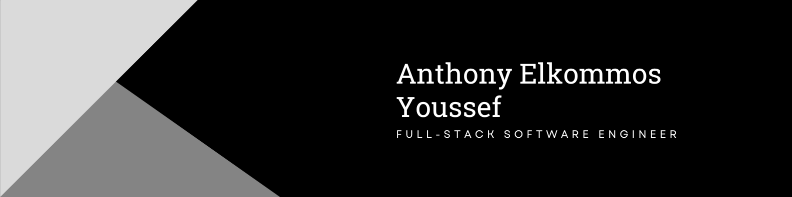

### Hi there 👋

- 🔭 I’m currently unemployed, but working on some personal projects. Mainly, QAMOUS ([Front-End](https://github.com/anthonyyoussef01/urban-dictionary-ar), [Back-End](https://github.com/anthonyyoussef01/urban-dictionary-ar-backend), [Data](https://github.com/anthonyyoussef01/urban-dictionary-ar-data-scraping))
- 🌱 I’m currently learning NodeJS, NestJS, and Rust
- 🤔 I’m looking for help with my Qamous Project so if you're interested, please reach out to me
- 💬 Ask me about my projects and experience
- 📫 How to reach me: go to my LinkedIn profile and message me there

## Technologies I've worked with

### Languages:

**High-level OOP Languages**:

**Low-level Languages / Systems Programming**:

<!--  -->

**Web and Mobile Application Development**:

<!--  -->
<!--  -->

**Outdated Languages**:

<!--  -->

**Data Science and Machine Learning**:

**Backend Development**:

<!--  -->

**Styling**:

**Markup**:

### SQL:

### IDEs:

**JetBrains IDEs**:

**Microsoft IDEs**:

**Other IDEs**:

**Data Analysis and Visualization IDEs**:

### Linux CLI and Code Editors (IDEs and CLEs):

